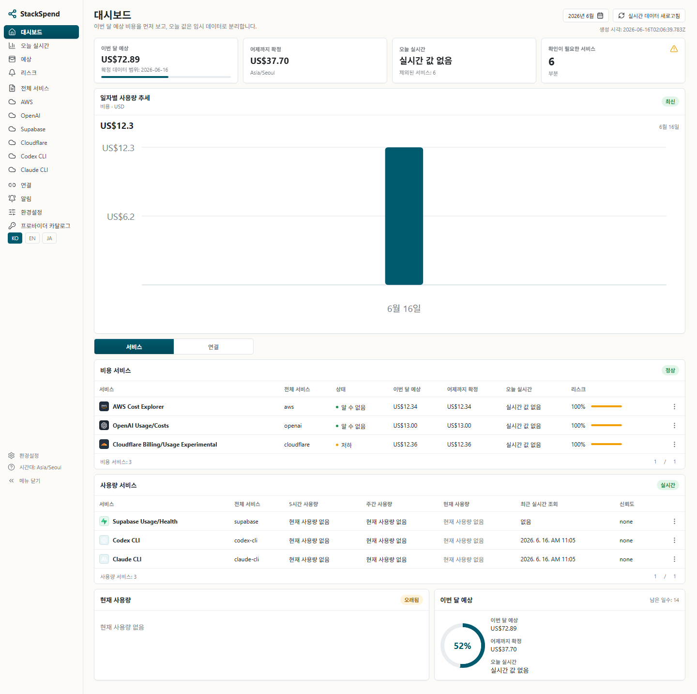
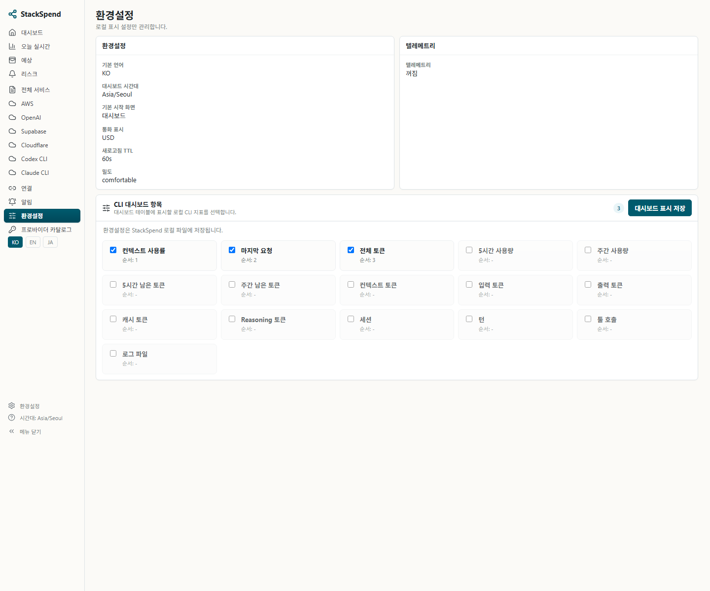
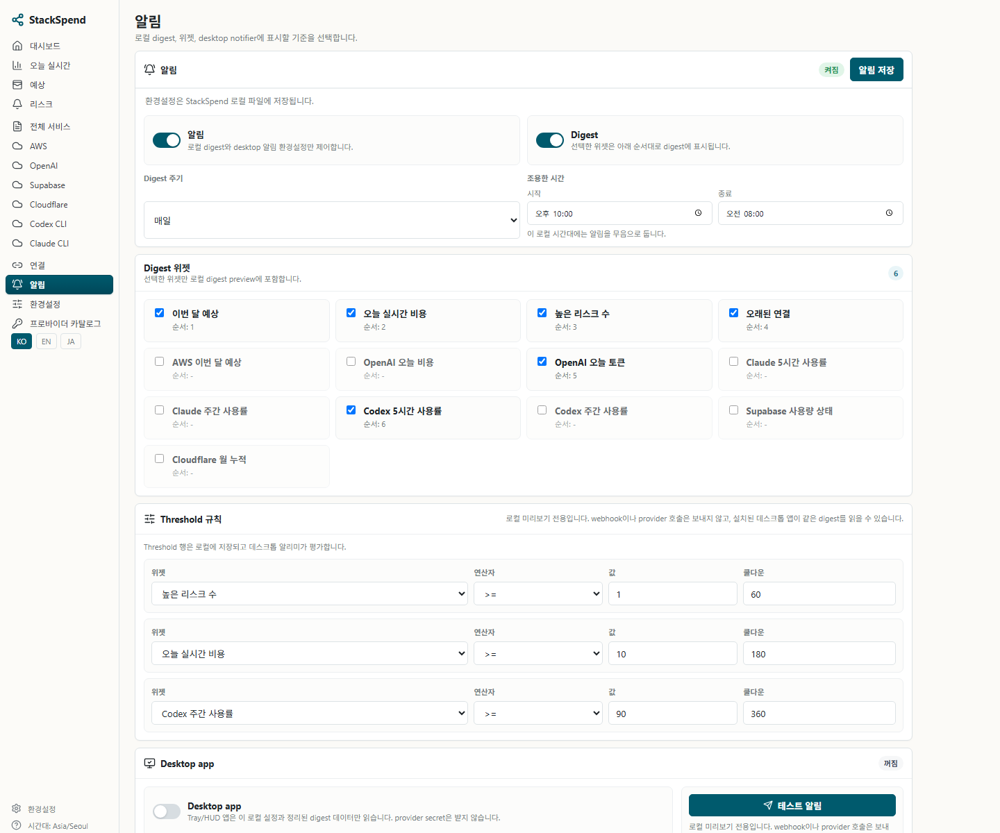

# StackSpend

Local-first cloud, SaaS, and AI usage dashboard for individual developers and small teams.

StackSpend reads provider usage into local SQLite, shows expected billing and usage risk in a local dashboard, and can surface compact desktop notifications/HUD widgets. It is not a hosted SaaS: provider connectors are read-only, secrets stay local, and telemetry is off by default.

## Current Status

StackSpend is preparing `v0.1.0-alpha.0` for local review.

The current alpha supports:

- CLI-first setup and sync.
- Local SQLite snapshots.
- Local Next.js dashboard.
- Native Tauri tray/HUD from source.
- AWS Cost Explorer fixture/live sync.
- OpenAI organization usage/cost fixture/live sync.
- Supabase usage/health fixture sync.
- Cloudflare billing/usage fixture sync.
- Local Codex CLI and Claude CLI usage estimates from local logs.
- Korean daily reports and optional Slack webhook delivery.

The npm alpha package is prepared as `@stackspend/cli`, but this repository workflow does not publish it.

## Screenshots

The screenshots below were regenerated from a fresh fixture-backed mock SQLite database. Fake environment labels only mark providers as connected for the UI; no live credentials, provider account identifiers, webhook URLs, or local Codex/Claude session data are included.

### English

Dashboard overview:


CLI dashboard field settings:


Desktop HUD:


Notification and HUD settings:


### 한국어

아래 스크린샷은 동일한 fixture 기반 목업 SQLite 데이터베이스에서 한국어 UI로 다시 캡처한 화면입니다. FAKE 환경 값은 로컬 UI에서 provider가 연결된 것처럼 표시하기 위한 라벨이며, 실제 credential, provider 계정 식별자, webhook URL, 로컬 Codex/Claude 세션 데이터는 포함하지 않습니다.

대시보드 개요:



CLI 대시보드 항목 설정:



데스크톱 HUD:


알림 및 HUD 설정:



## Provider Model

Cost providers and usage-only providers are intentionally shown separately in the dashboard because their columns and risk signals differ.

| Provider | Dashboard area | Status | Data | Auth |
|---|---|---|---|---|
| AWS Cost Explorer | Cost services | available | cost, usage, forecast | AWS profile / SSO |
| OpenAI Usage/Costs | Cost services | available | organization usage, costs | Admin API key |
| Cloudflare Billing/Usage | Cost services | experimental | billing, usage | API token |
| Supabase Usage/Health | Usage services | experimental | usage, health | OAuth / PAT |
| Codex CLI | Usage services | local-only | local usage and quota estimate | local CLI/logs |
| Claude CLI | Usage services | local-only | local usage and quota estimate | local CLI/statusline/logs |
| GCP | Connections only | planned/local setup | CLI and ADC readiness | gcloud CLI |

Supabase is currently modeled as usage/health, not billing. Fixed subscription costs and flat-plan SaaS spend need a separate local subscription-cost model or a provider billing connector before they should appear in the cost table.

For local AI CLIs, StackSpend prioritizes 5-hour quota percent, weekly quota percent, and rolling token usage where those values can be derived safely. The dashboard Preferences screen lets users choose which local CLI metrics appear in the usage table. See [docs/local-ai-cli-usage.md](docs/local-ai-cli-usage.md).

## Local-First Security

Cloud, SaaS, and AI usage data often contains sensitive identifiers and billing context. StackSpend is designed so users can inspect cost and usage risk without sending API keys or raw provider responses to a hosted service.

Core rules:

- Use process-local environment variables for v0.1 secrets.
- Do not commit `.env`, API keys, tokens, webhook URLs, account IDs, project IDs, invoice IDs, card data, emails, or raw billing profiles.
- Store normalized SQLite snapshots, not credential material.
- Redact raw provider payloads before persistence.
- Do not persist raw provider payloads in SQLite, dashboard JSON, reports, Slack payloads, logs, fixtures, screenshots, or test snapshots.
- Keep provider connectors read-only.
- Keep telemetry off by default; any future telemetry must be opt-in only.

See [docs/security-model.md](docs/security-model.md) and [SECURITY.md](SECURITY.md).

## Requirements

- Node.js 20.11 or newer.
- pnpm 11.5.0 through Corepack.
- Git.
- Node.js SQLite runtime, or `sqlite3` on `PATH` / `STACKSPEND_SQLITE_BIN` as a fallback.
- Rust/Cargo plus platform toolchains only when building the native Tauri tray/HUD.

For platform-specific setup, source builds, npm CLI installation notes, and screenshot fixture commands, see [docs/install.md](docs/install.md).

## Quickstart From Source

```bash
corepack enable
corepack prepare pnpm@11.5.0 --activate
pnpm install

pnpm --filter @stackspend/cli dev -- init
pnpm --filter @stackspend/cli dev -- sync --provider mock
pnpm --filter @stackspend/cli dev -- report daily --lang ko

npm run dev:web
```

Open `http://127.0.0.1:3000/en/dashboard/overview`.

`npm run dev:web` starts only the local web dashboard. `npm run dev` starts the web dashboard, the native taskbar/tray layer, and the Tauri dashboard window together. Use `npm run dev:hud` when you want the native HUD mode first.

For a production-style local run after building the web app and unsigned native desktop layer:

```bash
npm run build:local
npm start
```

`npm start` starts the built Next.js dashboard, waits for `http://127.0.0.1:3000/ko/dashboard/overview`, and then launches the built StackSpend tray/Tauri executable.

## Fixture Review

Fixture mode uses committed fake payloads under `tests/fixtures/providers` and does not require live credentials.

```bash
STACKSPEND_AWS_COST_EXPLORER_FIXTURE=tests/fixtures/providers/aws/cost-explorer-grouped-by-service.json \
  pnpm --filter @stackspend/cli dev -- sync --provider aws

STACKSPEND_OPENAI_USAGE_FIXTURE=tests/fixtures/providers/openai/usage-costs.json \
STACKSPEND_OPENAI_COSTS_FIXTURE=tests/fixtures/providers/openai/usage-costs.json \
  pnpm --filter @stackspend/cli dev -- sync --provider openai

STACKSPEND_SUPABASE_FIXTURE=tests/fixtures/providers/supabase/usage-health.json \
  pnpm --filter @stackspend/cli dev -- sync --provider supabase

STACKSPEND_CLOUDFLARE_FIXTURE=tests/fixtures/providers/cloudflare/billing-usage.json \
  pnpm --filter @stackspend/cli dev -- sync --provider cloudflare
```

Live connector paths are read-only and env-only in this alpha. Do not create `.env` files or commit live credentials.

## CLI Commands

Running `stackspend` without subcommands prints a slash-command home guide. In a local TTY it may continue into a minimal line-based slash prompt; in CI or non-TTY package review it prints the guide and exits `0`.

```bash
pnpm --filter @stackspend/cli dev
pnpm --filter @stackspend/cli dev -- --help
pnpm --filter @stackspend/cli dev -- --version
pnpm --filter @stackspend/cli dev -- doctor
pnpm --filter @stackspend/cli dev -- install --status
pnpm --filter @stackspend/cli dev -- modes
pnpm --filter @stackspend/cli dev -- init
pnpm --filter @stackspend/cli dev -- sync --provider mock
pnpm --filter @stackspend/cli dev -- dashboard check
pnpm --filter @stackspend/cli dev -- report daily --lang ko
```

Slash aliases are thin wrappers around the same commands:

```bash
pnpm --filter @stackspend/cli dev -- /help
pnpm --filter @stackspend/cli dev -- /version
pnpm --filter @stackspend/cli dev -- /doctor
pnpm --filter @stackspend/cli dev -- /install status
pnpm --filter @stackspend/cli dev -- /modes
pnpm --filter @stackspend/cli dev -- /init
pnpm --filter @stackspend/cli dev -- /dashboard check
pnpm --filter @stackspend/cli dev -- /sync mock
pnpm --filter @stackspend/cli dev -- /report ko
```

Home/help never creates `.env`, prints secret values, calls provider APIs, or enables telemetry.

## NPM Alpha CLI Preview

After `@stackspend/cli@alpha` is published:

```bash
npm install -g @stackspend/cli@alpha
stackspend --version
stackspend install --status
stackspend modes
stackspend doctor
stackspend sync --provider mock
```

During an interactive PowerShell, cmd, or shell install, the package asks which local surfaces to enable:

- CLI
- Web dashboard
- HUD

Press Enter to accept the recommended default, which selects all three. In CI or non-interactive npm installs, StackSpend writes that same all-selected profile automatically. Re-run `stackspend install` to change the local profile later.

The same source tree supports Windows and macOS. Local config paths and native desktop artifacts are selected per OS. The shared runtime lock defaults to `%APPDATA%\StackSpend\runtime.json` on Windows and `~/Library/Application Support/StackSpend/runtime.json` on macOS so the npm CLI and native tray can discover the same local runtime.

For local tarball review without publishing:

```bash
pnpm --filter @stackspend/cli build
cd apps/cli
npm pack
```

## Local Dashboard

The dashboard makes no provider API calls. It reads normalized SQLite data and safe live/local overlays only. If the database is missing, it returns a safe empty state.

Useful URLs:

- `http://127.0.0.1:3000/en/dashboard/overview`
- `http://127.0.0.1:3000/ko/dashboard/overview`
- `http://127.0.0.1:3000/hud?locale=en`
- `http://127.0.0.1:3000/en/settings/preferences`
- `http://127.0.0.1:3000/en/settings/notifications`

Use the CLI check command from another terminal:

```bash
pnpm --filter @stackspend/cli dev -- dashboard check
pnpm --filter @stackspend/cli dev -- dashboard check --url http://localhost:3000
```

The check command sanitizes the printed dashboard URL and ignores path, query, and hash values. It rejects URL credentials and does not start, package, or serve the Next.js app.

## Desktop Tray, Notifications, and HUD

The desktop tray/notifier opens the same local dashboard runtime and a compact always-on-top HUD at `/hud`. The HUD is a native desktop window, not a web page overlay. It supports configurable font size, opacity, always-on-top behavior, refresh, minimize, close, and a separate HUD widget list.

Notification digest widgets and HUD widgets are configured independently:

- Digest widgets control scheduled/local notification content.
- HUD widgets control what stays visible in the floating desktop HUD.
- CLI dashboard fields control which local CLI metrics appear in dashboard usage tables.

From the web dashboard:

- Open `Settings -> Preferences` to choose local CLI dashboard fields.
- Open `Settings -> Notifications` to configure digest widgets, thresholds, desktop app state, HUD font size, HUD opacity, always-on-top, and HUD widgets.

From the CLI:

```bash
stackspend notify prefs list
stackspend notify prefs hud-enable codex_weekly_percent
stackspend notify prefs hud-disable month_forecast
```

## Slack Report

Slack delivery is opt-in per run and requires `SLACK_WEBHOOK_URL` in the process environment:

```bash
pnpm --filter @stackspend/cli dev -- report daily --lang ko
pnpm --filter @stackspend/cli dev -- report daily --lang ko --send slack
```

Do not write webhook URLs into `.env`, docs, test fixtures, or committed files.

## Docker Local Review

Docker support is for local self-host/dev review only. The image and Compose file do not contain credentials.

```bash
docker compose build
docker compose run --rm stackspend pnpm --filter @stackspend/cli dev -- sync --provider mock
docker compose up stackspend
```

Compose stores SQLite data in the `stackspend_data` volume at `/data/stackspend.sqlite` and exposes the dashboard on `http://localhost:3000`.

The Compose environment includes fake fixture paths, so fixture connector review can run without secrets:

```bash
docker compose run --rm stackspend pnpm --filter @stackspend/cli dev -- sync --provider aws
docker compose run --rm stackspend pnpm --filter @stackspend/cli dev -- sync --provider openai
docker compose run --rm stackspend pnpm --filter @stackspend/cli dev -- sync --provider supabase
docker compose run --rm stackspend pnpm --filter @stackspend/cli dev -- sync --provider cloudflare
```

For a Docker build dry validation:

```bash
docker build --pull=false --target verify -t stackspend:m10-verify .
```

## Validation

Run the local validation gate with:

```bash
pnpm test
pnpm typecheck
git diff --check
npm run secret:scan
```

For documentation-only changes, at minimum run:

```bash
git diff --check -- README.md docs/install.md
npm run secret:scan
```
